# Evidencias del laboratorio – Blueprints React UI

## Índice de imágenes

| # | Descripción | Punto |
|---|---|---|
| 1 | El contenedor de Postgres corriendo (`docker ps`) | [Antes de empezar](#antes-de-empezar-dejar-todo-corriendo) |
| 2 | Salida de `npm test` con los 4 archivos en verde | [Antes de empezar](#antes-de-empezar-dejar-todo-corriendo) |
| 3 | Canvas vacío, sin blueprint cargado | [Punto 1](#punto-1-el-canvas-lienzo-para-dibujar) |
| 4 | Tabla con el plano "house" del autor john (2 puntos) | [Punto 2](#punto-2-listar-los-planos-de-un-autor) |
| 5 | Canvas con el plano "house" dibujado | [Punto 3](#punto-3-seleccionar-un-plano-y-graficarlo) |
| 6 | Tabla con los planos de "maria" usando el mock | [Punto 4](#punto-4-servicios-apimock-y-apiclient) |
| 7 | Canvas con el plano "garage" (mock) dibujado | [Punto 4](#punto-4-servicios-apimock-y-apiclient) |
| 8 | Tabla con "john"/"house" otra vez, ahora con el backend real | [Punto 4](#punto-4-servicios-apimock-y-apiclient) |
| 9 | Página principal vacía, con los estilos nuevos (tarjetas, nav, botón) | [Punto 6](#punto-6-estilos) |
| 10 | Tabla con los planos de "maria" (nombre/puntos/botón Open, con hover) | [Punto 6](#punto-6-estilos) |
| 11 | Canvas del plano "garage" abierto, con los estilos aplicados | [Punto 6](#punto-6-estilos) |
| 12 | Página principal en modo responsive (layout de una sola columna) | [Punto 6](#punto-6-estilos) |
| 13 | Salida de `npm test` con los 5 archivos y 12 pruebas en verde | [Punto 7](#punto-7-pruebas-unitarias) |
| 14 | Redirección a /login al intentar Edit sin sesión | [Opcionales](#actividades-opcionales-recomendaciones-del-readme) |
| 15 | Nav con sesión iniciada ("Nuevo blueprint" / "Cerrar sesión") | [Opcionales](#actividades-opcionales-recomendaciones-del-readme) |
| 16 | Formulario de creación de blueprint lleno | [Opcionales](#actividades-opcionales-recomendaciones-del-readme) |
| 17 | Blueprint creado en la tabla + canvas + Top 5 | [Opcionales](#actividades-opcionales-recomendaciones-del-readme) |
| 18 | Confirmación del navegador antes de borrar | [Opcionales](#actividades-opcionales-recomendaciones-del-readme) |
| 19 | Tabla después de borrar (optimistic update) | [Opcionales](#actividades-opcionales-recomendaciones-del-readme) |
| 20 | Banner de error con botón Reintentar | [Opcionales](#actividades-opcionales-recomendaciones-del-readme) |
| 21 | Top 5 blueprints ordenados por puntos | [Opcionales](#actividades-opcionales-recomendaciones-del-readme) |
| 22 | Lienzo con puntos agregados a mano (click a click) | [Opcionales](#actividades-opcionales-recomendaciones-del-readme) |
| 23 | Confirmación "Guardado ✓" tras corregir el bug de feedback | [Opcionales](#actividades-opcionales-recomendaciones-del-readme) |
| 24 | `npm test` con los 6 archivos y 25 pruebas en verde | [Opcionales](#actividades-opcionales-recomendaciones-del-readme) |

---

## Antes de empezar: dejar todo corriendo

Para poder probar cualquier punto, primero había que levantar los backends de los labs anteriores.

Prendimos el backend con JWT (el de la Parte 2), que es el que vamos a usar para las pruebas reales porque trae adentro tanto el login como toda la API de blueprints.

Para confirmar que de verdad funcionaba, no nos quedamos solo con que "arrancó": hicimos el flujo completo a mano con `curl`: nos logueamos, nos dieron un token, creamos un blueprint de prueba (`john/house`) y lo volvimos a consultar. Todo respondió como se esperaba.

De paso, notamos que los tests del frontend no estaban corriendo (fallaban todos por un tema de configuración de Vitest), y aprovechamos para revisarlos uno por uno. Resultó que no era solo configuración: había dos bugs reales. El mock del canvas para las pruebas no se estaba aplicando, y el formulario de crear blueprint tenía las etiquetas (`<label>`) sin conectar a sus campos, así que las pruebas no podían "encontrar" los inputs. Ya quedaron los 4 tests pasando.

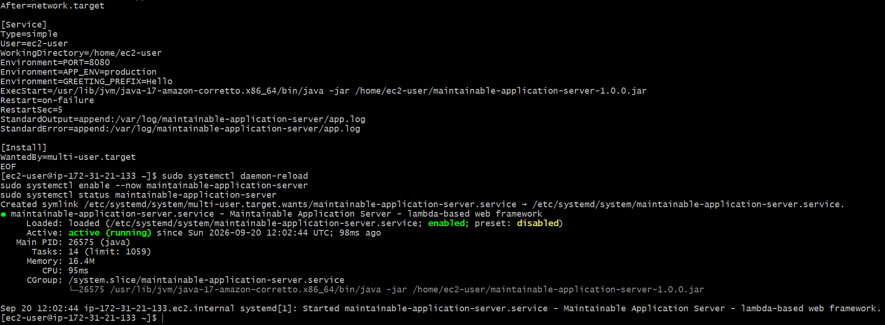
*Figura 1. El contenedor de Postgres corriendo (`docker ps`).*

*Figura 2. La salida de `npm test` con los 4 archivos en verde. (pendiente de agregar `evidencias/00-tests-pasando.png`)*

---

## Punto 1. El canvas (lienzo para dibujar)

El laboratorio pide que haya un canvas en la página, que sea su propio componente (`BlueprintCanvas`), y que tenga un tamaño razonable.

Al revisar el código nos dimos cuenta de que esto ya estaba prácticamente hecho: el componente existe, dibuja una cuadrícula de fondo, y cuando hay un blueprint cargado traza las líneas entre los puntos y marca cada punto con un círculo. El tamaño por defecto es justo el que sugiere el enunciado (520×360) y no se estira para ocupar toda la pantalla.

Lo único que le faltaba era un detalle: el canvas no tenía un identificador propio en el HTML (un `id`), solo lo controlaba React por dentro. Le agregamos un `id` (`blueprint-canvas` por defecto) para que quede explícito y se pueda referenciar desde afuera si hace falta, por ejemplo desde CSS o desde una prueba automatizada.

Probamos la página con el servidor corriendo y así se ve hoy: el canvas está ahí, con su cuadrícula, esperando a que le carguemos un plano. También confirmamos "en vivo", abriendo la consola del navegador, que el `id` efectivamente quedó puesto.

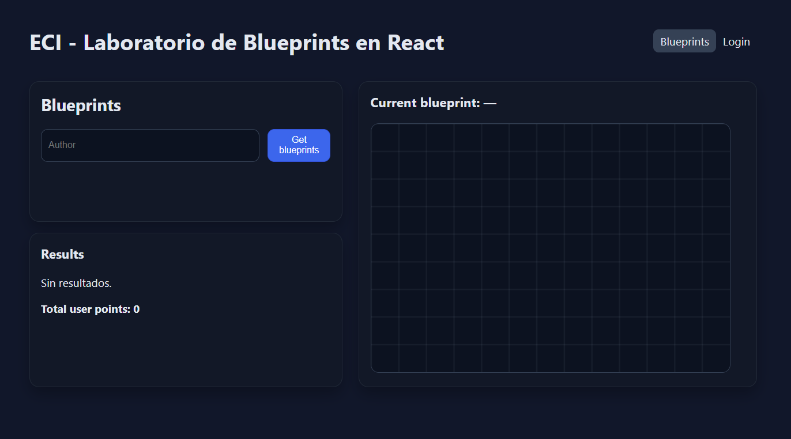
*Figura 3. La página principal con el canvas vacío (cuadrícula gris, sin blueprint cargado).*

**Archivo que cambió:** [`src/components/BlueprintCanvas.jsx`](./src/components/BlueprintCanvas.jsx)

---

## Punto 2. Listar los planos de un autor

Acá el laboratorio pide poder escribir el nombre de un autor, consultarlo, y ver sus planos en una tabla, con el nombre del plano, cuántos puntos tiene, y un botón para abrirlo.

En la pantalla esto ya estaba armado: hay un campo para escribir el autor, un botón "Get blueprints" y la tabla de resultados. El problema es que por debajo no estaba hablando bien con el backend real, y nos fuimos encontrando varias cosas mientras lo probábamos:

- Le estaba preguntando a una ruta que no existe tal cual (`/blueprints/autor`). La info real está en `/v1/blueprints/autor`.
- La respuesta del backend no viene "pelada": viene envuelta en un objeto con `code`, `message` y `data`. Había que sacar los datos de ahí adentro.
- El navegador bloqueaba las peticiones por un tema de CORS: el backend no está configurado para aceptar pedidos que vengan de `localhost:5173` (el puerto donde corre el frontend). Como no queríamos meternos a tocar el backend de otro laboratorio ya entregado, lo resolvimos desde el lado del frontend: configuramos Vite para que, mientras estamos programando, reenvíe por detrás las peticiones que empiezan en `/api` directo al backend, sin que el navegador se entere. Así ya no aplica la restricción de CORS.
- De paso nos dimos cuenta de que había un pedacito de código que no servía para nada: apenas se abría la página, se disparaba sola una petición para traer "todos los autores", pero ese resultado nunca se usaba en ninguna parte de la pantalla. Y como esa petición fallaba (por las mismas rutas mal apuntadas), dejaba la página como si algo hubiera "fallado" sin que nadie se enterara ni pasara nada raro visible. Como no cumplía ningún propósito, la quitamos.

Con esos cambios ya probamos buscar los planos del autor "john" (uno que habíamos creado de prueba cuando estábamos validando que el backend funcionara) y la tabla mostró bien su plano "house", con sus 2 puntos, y el botón para abrirlo.

Repasando el README, el punto pide que la tabla tenga exactamente tres cosas, y así quedaron:

- **Nombre del plano:** columna "Blueprint name", mostró "house".
- **Número de puntos:** columna "Number of points", mostró "2".
- **Botón Open para abrirlo:** una tercera columna con el botón "Open" al lado de cada fila.

Las tres columnas están armadas en [BlueprintsPage.jsx](./src/pages/BlueprintsPage.jsx), en la tabla que se arma recorriendo los resultados (`items.map(...)`).

Una aclaración importante: para poder probar esto tuvimos que "loguearnos" a mano, pidiendo el token por fuera (con curl), porque el backend real exige ese token para consultar cualquier cosa, y la pantalla de Login del frontend todavía no está bien conectada con el backend real (eso lo vamos a resolver más adelante, en su propio punto). Por ahora simplemente pusimos el token a la fuerza para poder comprobar que la tabla sí funciona de verdad.

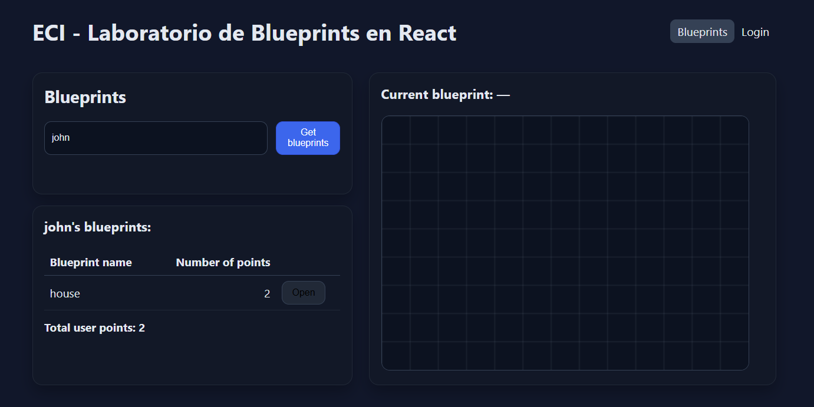
*Figura 4. La tabla mostrando el plano "house" del autor john, con 2 puntos.*

**Archivos que cambiaron:**
- [`src/features/blueprints/blueprintsSlice.js`](./src/features/blueprints/blueprintsSlice.js) (ruta correcta + lectura de la respuesta real)
- [`src/pages/BlueprintsPage.jsx`](./src/pages/BlueprintsPage.jsx) (se quitó la llamada que no servía para nada)
- [`vite.config.js`](./vite.config.js) (proxy para evitar el bloqueo de CORS mientras desarrollamos)
- [`src/services/apiClient.js`](./src/services/apiClient.js) (la URL base ahora es relativa, para aprovechar el proxy)
- [`.env.example`](./.env.example) (actualizado a la nueva URL relativa)

---

## Punto 3. Seleccionar un plano y graficarlo

Este punto pide que, al darle clic al botón "Open" de la tabla, pasen tres cosas: que se actualice un texto con el nombre del plano que se abrió, que se traigan sus puntos, y que se dibujen en el canvas (las líneas entre los puntos, y cada punto marcado).

En estos momentos el botón sí funciona, pero llama a la ruta vieja del backend (`/blueprints/autor/nombre`), así que la petición falla calladita y no pasa nada en la pantalla.

Le hicimos el mismo ajuste que al punto 2: apuntar a la ruta real (`/v1/blueprints/autor/nombre`) y sacar los datos de donde realmente vienen (`{code, message, data}`).

Con eso ya probamos el flujo completo: buscamos los planos de "john", le dimos clic a "Open" en la fila de "house", y pasó justo lo que pedía el enunciado: arriba dice "Current blueprint: house", y el canvas dibujó la línea entre sus dos puntos, cada uno marcado con un puntico amarillo.

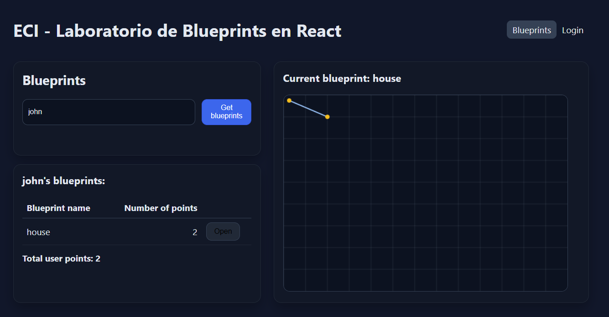
*Figura 5. El canvas con la línea y los puntos del plano "house", y el texto "Current blueprint: house".*

**Archivo que cambió:** [`src/features/blueprints/blueprintsSlice.js`](./src/features/blueprints/blueprintsSlice.js) (la función `fetchBlueprint`)

---

## Punto 4. Servicios `apimock` y `apiclient`

Este punto lo que pide es tener dos "servicios" que hagan lo mismo (traer todos los planos, traer los de un autor, traer uno puntual, y crear uno nuevo), uno que use datos de mentiras guardados en memoria (para poder probar la app sin depender de nada más) y otro que sí hable con el backend real. Y que se pueda cambiar de uno a otro con una sola variable en el `.env`, sin tocar código.

Armamos tres archivos nuevos en `src/services/`:

- **`blueprintsMockClient.js`**: el servicio de mentiras. Tiene unos planos inventados guardados en una lista (de "maria" y "carlos") y expone las 4 funciones que pide el enunciado (`getAll`, `getByAuthor`, `getByAuthorAndName`, `create`), todas trabajando sobre esa lista en memoria, sin llamar a ningún backend.
- **`blueprintsApiClient.js`**: el servicio real. Tiene las mismas 4 funciones, pero por debajo usan Axios para hablar con el backend de verdad (las mismas rutas que ya habíamos arreglado en los puntos 2 y 3).
- **`blueprintsService.js`**: el que decide cuál de los dos usar, mirando la variable `VITE_USE_MOCK` del `.env`. Si es `true`, usa el de mentiras; si no, usa el real. Ese es el "cambio con una sola línea" que pide el laboratorio: solo hay que tocar esa variable, nada de código.

Un detalle de nombres que vale la pena contar: el enunciado sugiere llamar al servicio real "apiclient", pero ya existía un archivo `apiClient.js` (con mayúscula) que es la configuración base de Axios. En Windows, el sistema de archivos no distingue mayúsculas de minúsculas, así que un archivo `apiclient.js` y otro `apiClient.js` serían el mismo archivo y uno se comería al otro. Por eso el servicio real se llama `blueprintsApiClient.js` en vez de `apiclient.js`, dejando esto explicado en un comentario en el código.

Después conectamos el Redux (`blueprintsSlice.js`) para que, en vez de llamarle directo a Axios con URLs escritas a mano, le pregunte a `blueprintsService`. Así el cambio de mock a real (o viceversa) se nota en toda la aplicación, no solo en un archivo suelto que nadie usa.

De paso, encontramos que había un pedazo de la interfaz (`fetchAuthors`) que ya habíamos dejado sin usar desde el punto 2, y como ahora `getAll` cumple ese mismo propósito dentro de la interfaz oficial del servicio, terminamos de quitarlo del todo.

Para comprobar que el cambio funciona de verdad y no es solo teoría, lo probamos en los dos sentidos:

1. Con `VITE_USE_MOCK=true`: buscamos el autor "maria" (que no existe en el backend real, solo en los datos de mentiras) y salieron sus dos planos, "garage" (3 puntos) y "pool" (2 puntos), sin que la app tocara el backend para nada. Abrimos "garage" y el canvas dibujó su figura correctamente.
2. Con `VITE_USE_MOCK=false`: buscamos "john" otra vez y volvió a traer "house" con 2 puntos, exactamente como en los puntos 2 y 3, esta vez sí hablando con el backend real.

Los dos casos funcionaron sin tocar ni una línea de código, solo cambiando esa variable. La pantalla se ve igual en ambos modos (mismos componentes, mismos estilos): lo único que cambia es de dónde salen los datos, que es justo lo que se estaba probando.

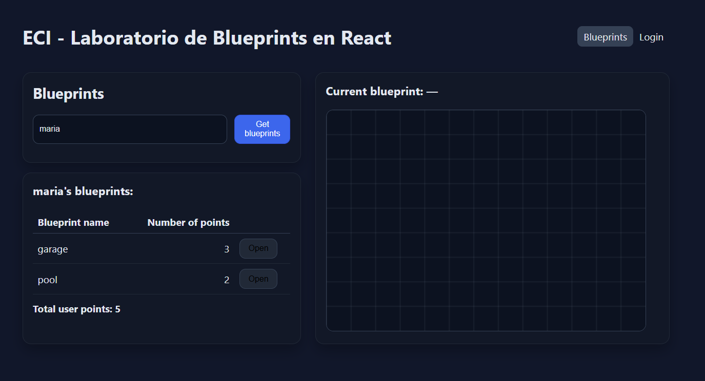
*Figura 6. La tabla mostrando los planos "garage" y "pool" de maria, usando el mock (sin backend).*

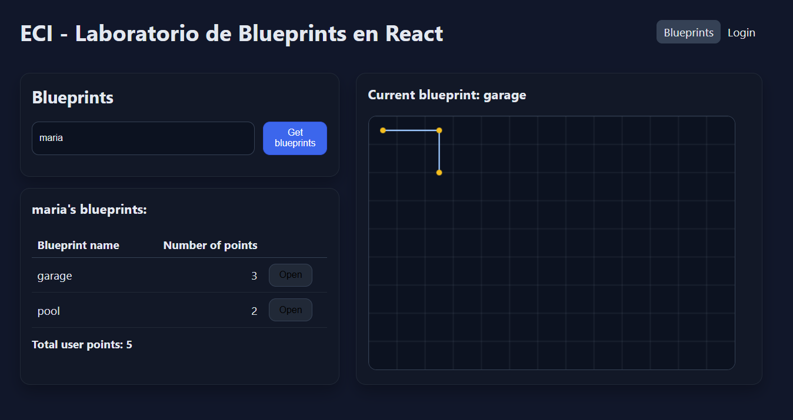
*Figura 7. El canvas dibujando el plano "garage" con sus 3 puntos (datos del mock).*

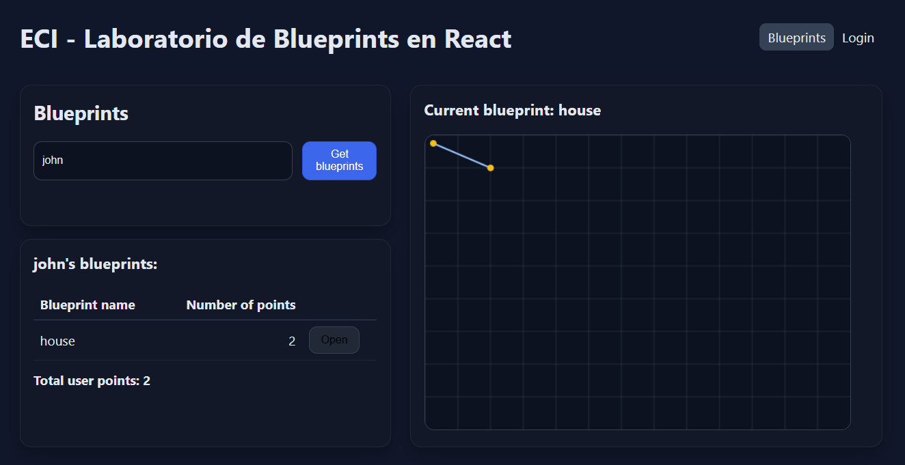
*Figura 8. La misma búsqueda de "john" mostrando "house" con 2 puntos, ahora con `VITE_USE_MOCK=false` (backend real).*

**Archivos nuevos:**
- [`src/services/blueprintsMockClient.js`](./src/services/blueprintsMockClient.js)
- [`src/services/blueprintsApiClient.js`](./src/services/blueprintsApiClient.js)
- [`src/services/blueprintsService.js`](./src/services/blueprintsService.js)

**Archivos que cambiaron:**
- [`src/features/blueprints/blueprintsSlice.js`](./src/features/blueprints/blueprintsSlice.js) (ahora usa `blueprintsService` en vez de Axios directo; se quitó `fetchAuthors`)
- [`.env.example`](./.env.example) (se agregó `VITE_USE_MOCK`)

---

## Punto 5. Interfaz con React (estado en Redux)

Este punto pide dos cosas: que el nombre del plano actual se muestre en pantalla como parte del estado global de Redux (no escrito a mano en algún lado), y que no se manipule el DOM directamente, sino que todo pase por componentes y estado de React.

Al revisar el código nos dimos cuenta de que esto ya estaba resuelto desde que se armaron los puntos anteriores, así que no hubo que cambiar nada. Igual lo comprobamos a fondo, no nos quedamos con la primera impresión:

- El nombre del plano abierto vive en `current`, dentro de `blueprintsSlice.js` (el estado global de Redux). La pantalla lo lee con `useSelector` en `BlueprintsPage.jsx` y lo muestra como "Current blueprint: nombre-del-plano". Nunca se escribe directo en el HTML.
- Repasamos **todo** el código del frontend buscando cualquier manipulación directa del DOM (cosas como `document.algo`, `innerHTML`, `querySelector`) y no encontramos ninguna, salvo la línea estándar de arranque de React en `main.jsx` (`document.getElementById('root')`), que es obligatoria en cualquier app de React y no cuenta como una violación de esta regla.
- El único lugar donde se toca algo "por fuera" de React es el canvas, pero ahí no queda otra: dibujar líneas y puntos requiere su propia API nativa (`ctx`), a la que se llega a través de un `ref` de React, tal como se hace normalmente en cualquier app de React que use canvas.

Esto ya se puede ver, de hecho, en la Figura 5 del punto 3: ahí aparece el texto "Current blueprint: house", que es justo ese dato saliendo del estado global.

**Archivos revisados (sin cambios):** `src/features/blueprints/blueprintsSlice.js`, `src/pages/BlueprintsPage.jsx`, `src/components/BlueprintCanvas.jsx`, y el resto de `src/` para descartar manipulación directa del DOM.

---

## Punto 6. Estilos

Este punto pide agregar estilos para mejorar la presentación (se puede usar Bootstrap u otro framework) y ajustar tabla, botones y tarjetas para que se acerquen al mock de referencia.

Ya existía un `styles.css` propio con tema oscuro (tarjetas, botones, inputs, grid), así que no partimos de cero. Lo que encontramos fue que buena parte de la tabla y del layout de la página principal (`BlueprintsPage.jsx`) estaba armada con estilos escritos a mano directo en el JSX (`style={{...}}`), en vez de usar clases del CSS. Eso hacía difícil mantenerlo y le faltaban detalles de interacción: los botones no cambiaban al pasar el mouse, los inputs no mostraban foco, las filas de la tabla no se resaltaban, y el layout de dos columnas no se adaptaba en pantallas angostas.

Hicimos estos ajustes:

- Sacamos los estilos inline de la tabla y el layout de `BlueprintsPage.jsx` y los pasamos a clases nuevas en `styles.css` (`.table`, `.table-wrap`, `.page-layout`, `.search-row`, `.stat-line`).
- Agregamos estados que no existían: los botones y las filas de la tabla ahora resaltan al pasar el mouse, los campos de texto muestran un borde de foco, y los botones deshabilitados se ven apagados.
- Agregamos una regla para que el layout de dos columnas (la lista de planos a la izquierda, el canvas a la derecha) se convierta en una sola columna cuando la pantalla es angosta, en vez de quedar apretado.
- De paso limpiamos un par de estilos sueltos que ya no hacían falta (`marginTop: 0` repetido en varios títulos, un color de error escrito a mano) y los dejamos como clases reutilizables (`.muted`, `.error-text`).

Lo revisamos en el navegador y tomamos las capturas. De paso encontramos algo que no era de estilos: no existía el archivo `.env` en el proyecto (solo `.env.example`), así que la app no estaba usando el mock (`VITE_USE_MOCK` quedaba sin definir) y por eso al principio "maria" y "carlos" no traían resultados. Copiamos `.env.example` a `.env` y reiniciamos el servidor; con eso el mock quedó activo y ya se pudo probar la tabla con datos reales del mock.

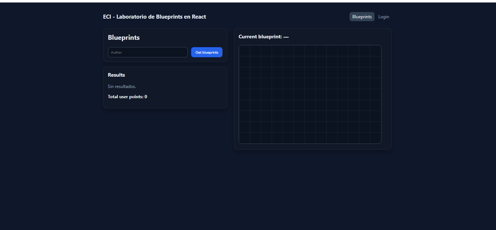
*Figura 9. La página principal con las tarjetas, el nav y el botón "Get blueprints" ya con los estilos nuevos.*

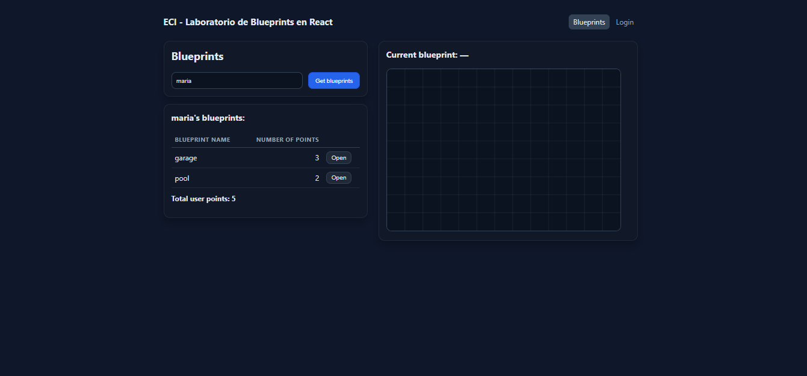
*Figura 10. La tabla mostrando los planos "garage" (3 puntos) y "pool" (2 puntos) de maria, con el botón "Open" en su versión compacta (`.btn.sm`).*

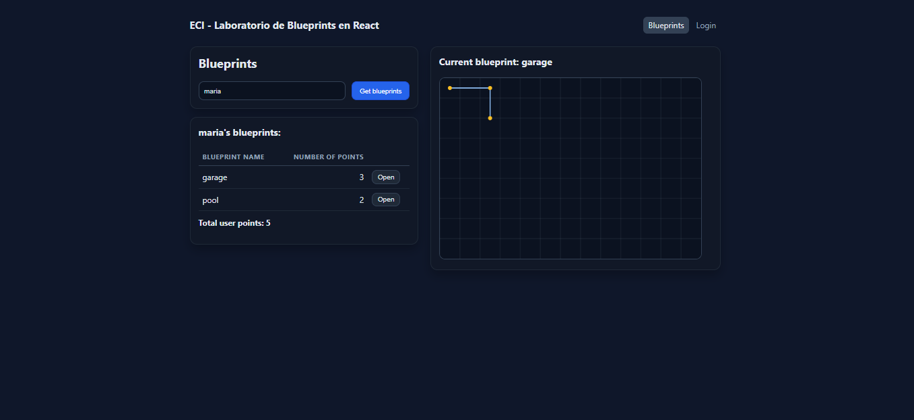
*Figura 11. Al abrir "garage": el título "Current blueprint: garage" y el canvas dibujando la figura.*

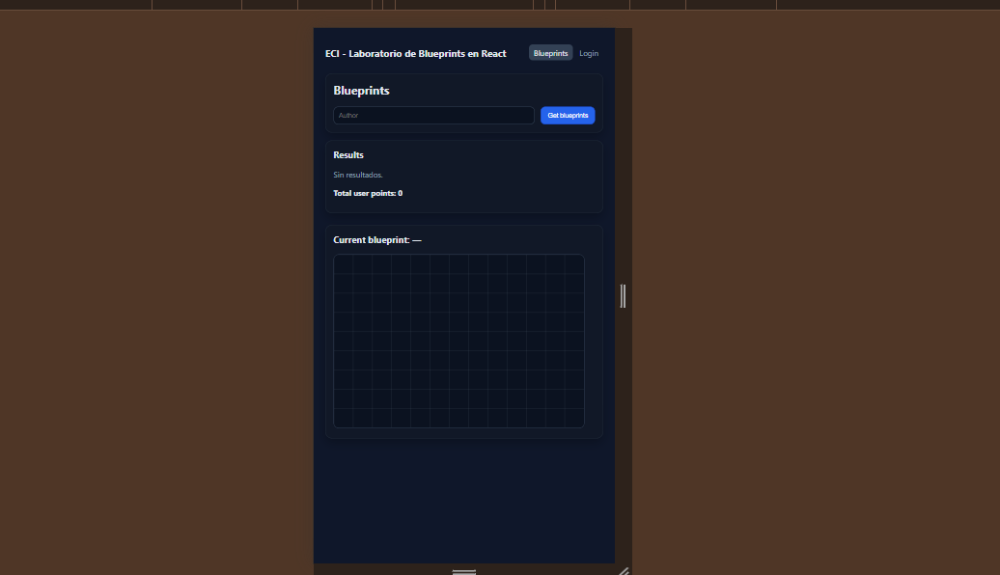
*Figura 12. La misma página en modo responsive (DevTools): el layout de dos columnas colapsó a una sola, confirmando que la media query funciona.*

**Archivos que cambiaron:**
- [`src/styles.css`](./src/styles.css)
- [`src/pages/BlueprintsPage.jsx`](./src/pages/BlueprintsPage.jsx)
- [`src/pages/LoginPage.jsx`](./src/pages/LoginPage.jsx) (limpieza menor)
- [`src/pages/BlueprintDetailPage.jsx`](./src/pages/BlueprintDetailPage.jsx) (limpieza menor)

---

## Punto 7. Pruebas unitarias

Este punto pide pruebas con Vitest + Testing Library que validen tres cosas: que el canvas se renderice, que el formulario se pueda enviar, y alguna interacción básica con Redux (el ejemplo del README es el dispatch de `fetchByAuthor`).

Como se contó al principio de este documento, los 4 tests que ya existían estaban rotos por 3 bugs reales (no solo configuración) y ya los habíamos arreglado antes de empezar con los puntos del laboratorio. Revisando esos 4 tests contra lo que pide el punto 7, nos dimos cuenta de que **las tres cosas que exige el README ya estaban cubiertas**:

- Render del canvas → `tests/BlueprintCanvas.test.jsx`.
- Envío del formulario → `tests/BlueprintForm.test.jsx`.
- Dispatch de `fetchByAuthor` → `tests/BlueprintsPage.test.jsx`.

Pero encontramos un hueco real al mirar más de cerca: ninguno de los tests probaba lo que se construyó en los puntos 2, 3 y 4 del laboratorio. El test del slice de Redux (`blueprintsSlice.test.jsx`) solo comprobaba que el estado inicial estuviera vacío, y no había ningún test para los servicios nuevos (`apimock`/`apiclient`) que armamos en el punto 4.

Agregamos dos cosas:

1. **Tres casos nuevos en `blueprintsSlice.test.jsx`**, probando los reducers que sí cambian el estado cuando se completa una petición: que `fetchByAuthor` guarde los planos bajo el nombre del autor correcto, que `fetchBlueprint` actualice el plano abierto actualmente, y que `createBlueprint` agregue un plano nuevo a la lista de su autor si ya existía. Estos se prueban llamando al reducer directamente con la acción, sin necesidad de mocks ni de un store completo.
2. **Un archivo nuevo, `blueprintsMockClient.test.jsx`**, con cinco casos que prueban el servicio de datos de prueba en memoria: que `getAll` traiga todo, que `getByAuthor` filtre bien por autor, que `getByAuthorAndName` traiga el plano correcto (y que rechace la promesa si no existe), y que `create` agregue un plano nuevo que después sí aparece al consultarlo.

De paso, revisando `BlueprintsPage.test.jsx` para agregar lo anterior, notamos que el mock del slice todavía declaraba una función `fetchAuthors` que ya no existe en el código real desde que se limpió en el punto 2 — era código muerto en el test que no hacía nada, así que lo quitamos.

No agregamos pruebas para `blueprintsApiClient.js` (el servicio que sí habla con el backend real) porque probarlo bien requeriría simular Axios, y tampoco para el interruptor de `blueprintsService.js` (que decide entre mock y real), porque depende de una variable de entorno que se lee apenas arranca la aplicación, lo que lo hace más delicado de probar de forma confiable. Los dejamos fuera del alcance de esta sesión; no son necesarios para cumplir el requisito.

Con todo esto, quedaron **5 archivos de test y 12 pruebas en total, todas pasando**, y el lint sigue limpio.

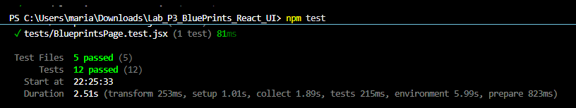
*Figura 13. `npm test` corriendo los 5 archivos de test (los 4 originales + `blueprintsMockClient.test.jsx`), 12 pruebas en total, todas en verde.*

**Archivos nuevos:**
- [`tests/blueprintsMockClient.test.jsx`](./tests/blueprintsMockClient.test.jsx)

**Archivos que cambiaron:**
- [`tests/blueprintsSlice.test.jsx`](./tests/blueprintsSlice.test.jsx) (3 casos nuevos)
- [`tests/BlueprintsPage.test.jsx`](./tests/BlueprintsPage.test.jsx) (se quitó el mock muerto de `fetchAuthors`)

---

## Actividades opcionales 

Con los 7 requerimientos obligatorios cerrados, hicimos también varias de las actividades opcionales sugeridas al final del README. Ya probamos todo esto en el navegador y tomamos las capturas — quedan documentadas abajo.

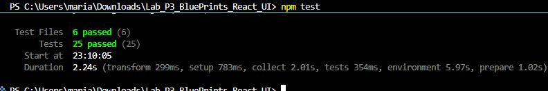
*Figura 24. `npm test` corriendo en la terminal después de todos los cambios de esta sección: 6 archivos, 25 pruebas, todas en verde.*

### Login real + rutas protegidas

El login ahora apunta a la ruta y forma de respuesta reales del backend, y hay un componente `PrivateRoute` que manda a `/login` a cualquiera que intente entrar a "Nuevo blueprint" o a "Edit" sin sesión iniciada.

**Aclaración:** para las capturas que siguen (login, crear, editar, borrar) no nos logueamos de verdad contra el backend, porque para este laboratorio no teníamos el backend real levantado. Simulamos la sesión pegando un token de mentiras directo en `localStorage` desde la consola del navegador (`localStorage.setItem('token', 'fake-jwt-de-prueba')`). Esto alcanza para probar `PrivateRoute` y todo lo que solo depende de que *exista* un token (que es lo único que revisa `PrivateRoute`), pero no prueba el login real end-to-end contra el backend (eso sigue pendiente, requeriría levantar Postgres + el backend P2).

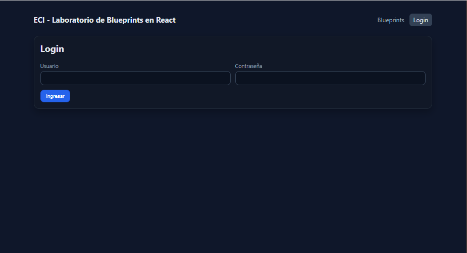
*Figura 14. Al intentar entrar a "Edit" sin sesión iniciada, `PrivateRoute` redirige a `/login` (el nav muestra "Login", no "Cerrar sesión").*

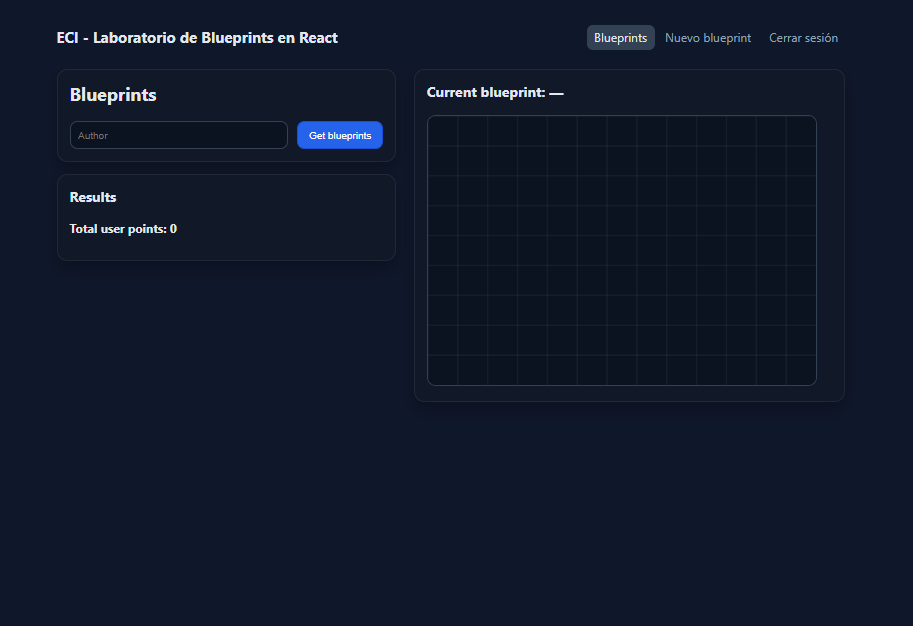
*Figura 15. Con un token en `localStorage`, el nav cambia a "Blueprints / Nuevo blueprint / Cerrar sesión".*

### Crear un blueprint desde la UI

Nueva página en "Nuevo blueprint" (aparece en el nav solo si estás logueada) que usa el formulario que ya existía pero que antes no estaba conectado a nada.

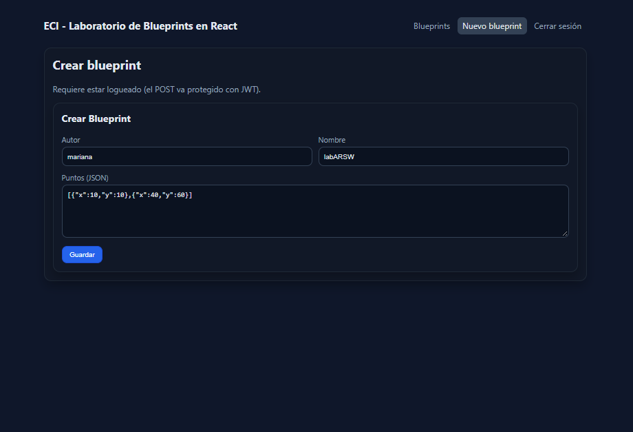
*Figura 16. El formulario de "Nuevo blueprint" (autor `mariana`, nombre `labARSW`, puntos en JSON) antes de guardar.*

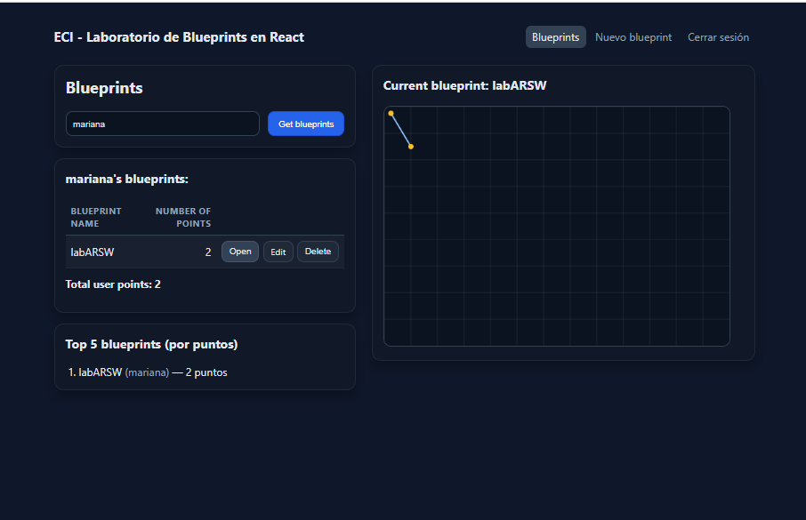
*Figura 17. Después de guardar: "labARSW" aparece en la tabla de mariana con 2 puntos, el canvas de la derecha lo dibuja, y de paso se ve la tarjeta "Top 5 blueprints" funcionando.*

### Editar y borrar (CRUD completo)

Cada fila de la tabla ahora tiene tres botones: `Open` (como antes), `Edit` (nuevo, lleva a un editor) y `Delete` (nuevo, pide confirmación).

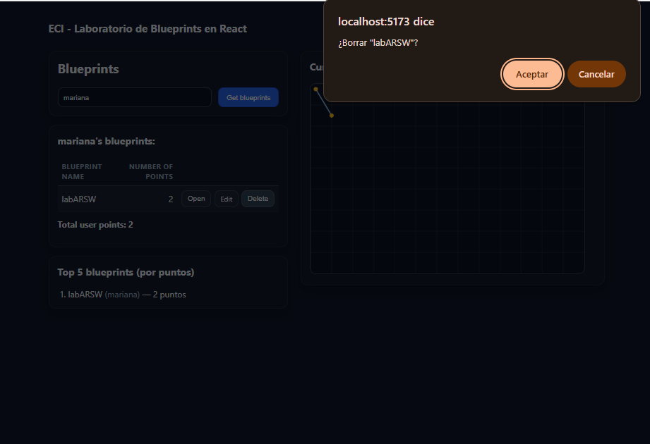
*Figura 18. El `window.confirm()` del navegador preguntando "¿Borrar 'labARSW'?" antes de despachar `removeBlueprint`.*

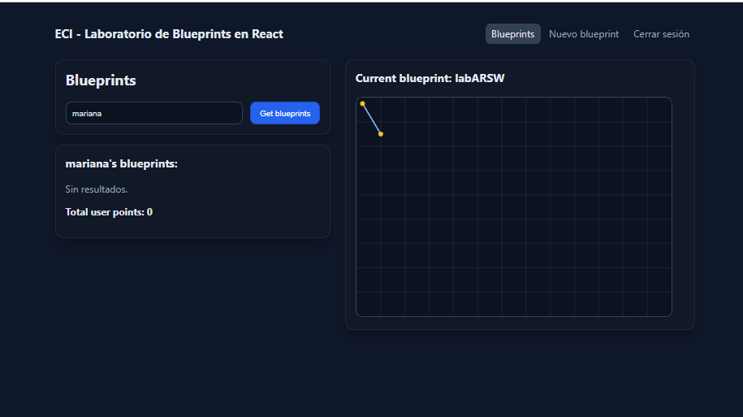
*Figura 19. Después de confirmar: "Sin resultados." para mariana — el blueprint desapareció de la tabla (optimistic update, se quita del estado antes de que el servicio termine).*

### Dibujo interactivo (click para agregar puntos)

La pantalla de "Edit" ya no es un dibujo fijo: es un lienzo donde cada click agrega un punto nuevo, con un botón para deshacer el último y otro para guardar.

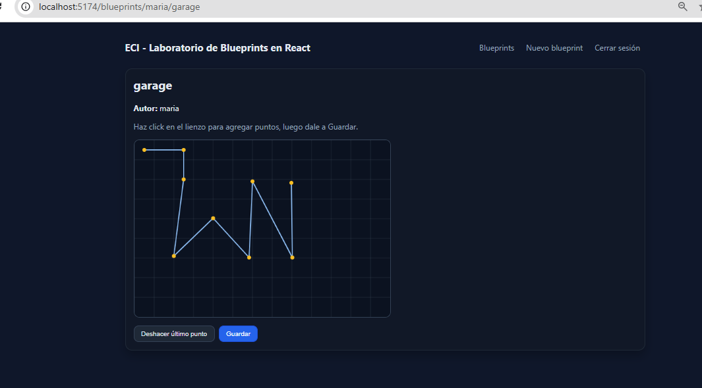
*Figura 22. Editando "garage" (autor maria): se agregaron varios puntos a mano haciendo click sobre el lienzo, formando el zigzag que se ve en la imagen, antes de guardar.*

Al probar esto encontramos un bug real: el botón "Guardar" no daba ninguna confirmación visual, así que parecía que no hacía nada (aunque el guardado sí funcionaba por debajo — el problema era solo de feedback, la promesa del mock resuelve tan rápido que React nunca alcanzaba a pintar el estado "Guardando..."). Lo corregimos agregando una confirmación que sí se queda en pantalla:

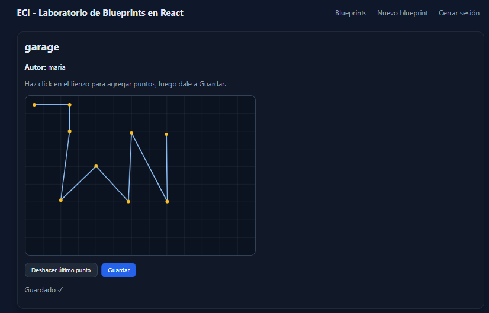
*Figura 23. Después de corregir el bug: al darle "Guardar" aparece "Guardado ✓" debajo de los botones, confirmando que el `updateBlueprint` sí terminó.*

### Errores + Retry y estados de carga por operación

Si una búsqueda de autor falla, ahora aparece un mensaje de error con un botón "Reintentar" en vez de quedarse en silencio.

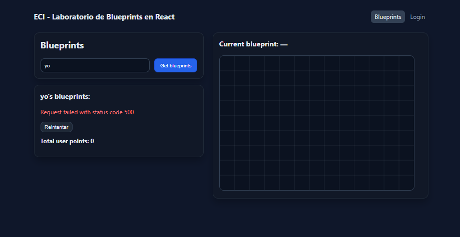
*Figura 20. Búsqueda del autor "yo" con `VITE_USE_MOCK=false`: aparece el error real del servidor ("Request failed with status code 500") junto con el botón "Reintentar", en vez de quedarse en silencio como antes.*

### Top 5 blueprints por puntos

Nueva tarjeta que aparece debajo de la tabla de resultados (solo si ya buscaste al menos un autor), con los 5 blueprints con más puntos de entre todos los que ya se han consultado en esta sesión.

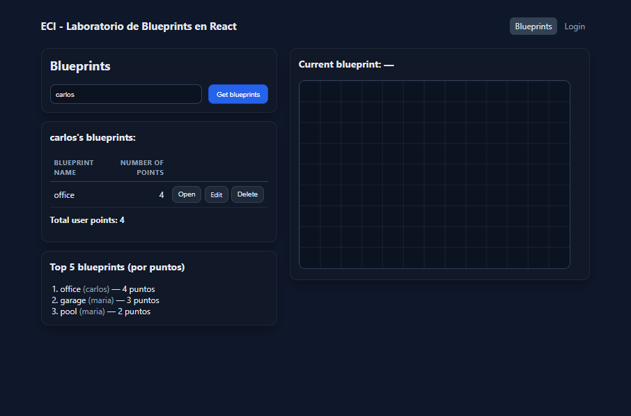
*Figura 21. Después de buscar "maria" y "carlos": la tarjeta "Top 5 blueprints" queda ordenada correctamente de mayor a menor ("office" 4 puntos, "garage" 3 puntos, "pool" 2 puntos).*
